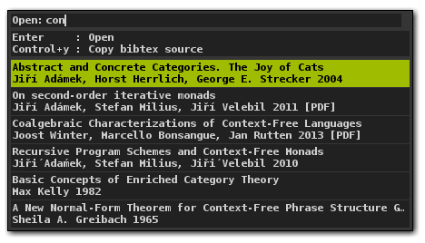
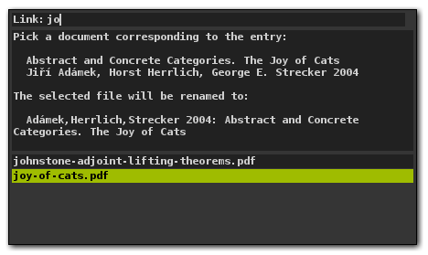

# The bibtex-powered browser for your PDF document collection

Tired of chosing the right filenames for your PDF documents? Or do you loose
track of your PDF documents because of different file naming conventions?
Or are you tired of giving your PDF very long names manually because they
should contain the title and the full author list?

The `rofi-bibbrowser` solves all these problems and offers a `rofi` based menu
to quickly filter all your PDF documents based on the tags of a bibtex file!

## Features

* Offers a menu containg entries of a bibtex-file and PDF documents of a
  configurable directory
* Automatically associates PDFs with bibtex entries (and hides associated PDF
  files in the main menu in preference of the bibtex entry)
* Opens selected documents via `xdg-open`
* Renames PDFs to canonical name based on the bibtex entry
* Copying the bibtex-entry from the main menu to the clipboard

## Behaviour

Initially, you are presented a menu containing an item for each entry of your
bibtex file and containing all PDFs of your document directory that could not
be associated to a bibtex entry. Bibtex entries with an associated PDF file are
indicated by the `[PDF]` marker.



If you select a bibtex entry that has at least one PDF associated to it, it
will open that PDF. Otherwise, it will ask you for the PDF document for that
bibtex entry.



Selecting the corresponding PDF document will rename it to a canonical filename
and open it afterwards.

## Configuration file
The configuration file is just a python script and located at
`~/.config/rofi-bibbrowserrc`. You can overwrite any function that has been
defined before and adjust it to your needs. Run `rofi-bibbrowser
--default-config` to see the default definitions. You can find my personal
config [in my dotfiles](https://github.com/t-wissmann/dotfiles/blob/master/config/rofi-bibbrowserrc).

## Requirements

* A current version of `rofi` in your PATH
* Python 3
* `xdg-open` (for opening PDF documents)
* `xclip` (for bibtex source yanking)
* https://github.com/aclements/biblib either globally or cloned to the subdirectory `biblib/`

## Installation

Install `rofi`, `xdg-open`, `xclip` to your PATH. Install https://github.com/aclements/biblib
globally or simply clone it as a subdirectory:
```
git clone https://github.com/aclements/biblib
```
If you install it as a subdirectory, make sure that you call `rofi-bibbrowser`
with an absolute path and not through a symlink that is in a PATH directory.

